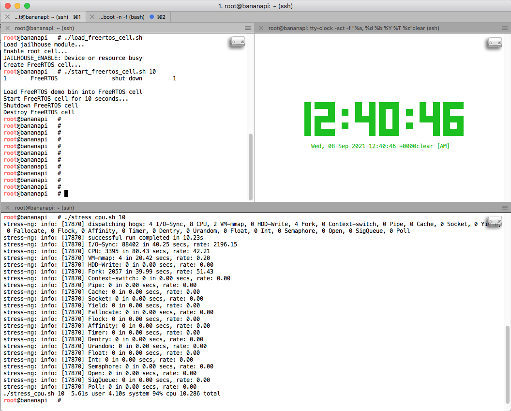

## Introduction

In order to execute the following demo, you need a compiling machine with Linux (e.g., Ubuntu 18.04), and a BananaPI board (ref. [1]). 
Both machines should be on the same network subnet.

## Install Bananian

On compiling machine,
```
#HERE WE USE **BANANIAN** AS OUR BANANAPI'S OS
$ wget https://dl.bananian.org/releases/bananian-latest.zip
$ sudo apt-get update && sudo apt-get install unzip screen
$ unzip ./bananian-latest.zip
$ lsblk | grep mmcblk
```

Write the image to sdcard, replace `mmcblk0` below with the device name
```
# returned from `lsblk`
$ sudo dd bs=1M if=~/bananian-*.img of=/dev/mmcblk0
```

Insert the sd-card to BananaPi, connect it to our machine using ttl cable.
```
#On Ubuntu,
$ screen /dev/ttyUSB0 115200

#On BananaPi, login with root/pi, then expand the filesystem
$ bananian-config

```

Choose `y` for `Do you want to expand the root file system`.
Feel free to configure other stuff as well.

```
//ON BANANIAN

$ apt-get update && apt-get install -y u-boot-tools vim git make gcc sshfs python python-dev python-pip
$ mkdir /p1
$ mount /dev/mmcblk0p1 /p1
$ vi /p1/boot.cmd
$ umount /p1
```

Append ``mem=932M vmalloc=512M`` at the end of the first line that starts with setenv bootargs.
You should obtain something like the following:

```
#-------------------------------------------------------------------------------
# Boot loader script to boot with different boot methods for old and new kernel
# Credits: https://github.com/igorpecovnik - Thank you for this great script!
#-------------------------------------------------------------------------------
if load mmc 0:1 0x00000000 uImage-next
then
# mainline kernel >= 4.x
#-------------------------------------------------------------------------------
setenv bootargs console=ttyS0,115200 console=tty0 console=tty1 root=/dev/mmcblk0p2 rootfstype=ext4 elevator=deadline rootwait mem=932M vmalloc=512M
load mmc 0:1 0x49000000 dtb/${fdtfile}
load mmc 0:1 0x46000000 uImage-next
bootm 0x46000000 - 0x49000000
#-------------------------------------------------------------------------------
else
# sunxi 3.4.x
#-------------------------------------------------------------------------------
setenv bootargs console=ttyS0,115200 console=tty0 console=tty1 sunxi_g2d_mem_reserve=0 sunxi_ve_mem_reserve=0 hdmi.audio=EDID:0 disp.screen0_output_mode=EDID:1680x1050p60 root=/dev/mmcblk0p2 rootfstype=ext4 elevator=deadline rootwait
setenv bootm_boot_mode sec
load mmc 0:1 0x43000000 script.bin
load mmc 0:1 0x48000000 uImage
bootm 0x48000000
#-------------------------------------------------------------------------------
fi
```

After saving the file, create u-boot recognizable image *.src from *.cmd using mkimage:

```
$ cd /p1
$ mkimage -C none -A arm -T script -d boot.cmd boot.scr
```

## Cross-compile kernel and build jailhouse with FreeRTOS cell

On Compiling machine, 
```
apt-get update && apt-get install -y u-boot-tools sshfs make gcc vim python3-mako device-tree-compiler 
```

Ensure to download jailhouse, FreeRTOS cell, and the proper Linux version for Jailhouse (in this demo, we used Siemens Jailhouse-enabled Linux, v4.19). You need to enable FuseFS.

```
# git clone https://github.com/siemens/freertos-cell
# git clone https://github.com/siemens/jailhouse.git
# git clone -b jailhouse-enabling/4.19 https://github.com/siemens/linux.git linux_siemens_4.19
# cd linux_siemens_4.19/
# make ARCH=arm menuconfig 
````

Obtaining cross-compiling tool-chain from [Linaro Official site](https://www.linaro.org/downloads/). In this case, we use v7.3.1-2018.05-x86_64_arm.

```
# wget https://releases.linaro.org/components/toolchain/binaries/7.3-2018.05/arm-linux-gnueabihf/gcc-linaro-7.3.1-2018.05-x86_64_arm-linux-gnueabihf.tar.xz
# tar -xz gcc-linaro-7.3.1-2018.05-x86_64_arm-linux-gnueabihf.tar.xz
# export PATH=$PATH:/PATH/TO/gcc-linaro-7.3.1-2018.05-x86_64_arm-linux-gnueabihf/bin
# [IF NEEDED, clean previous compilation] make ARCH=arm CROSS_COMPILE=arm-linux-gnueabihf- KDIR=../linux_siemens_4.19/ clean
```

Compile the kernel, jailhouse, and FreeRTOS:
```
# make ARCH=arm CROSS_COMPILE=arm-linux-gnueabihf- -j$(nproc) uImage modules dtbs LOADADDR=40008000
# cd ..
```
Before compiling jailhouse and FreeRTOS, you need to patch ``bananapi_jailhouse.patch``, to include missing devices.

```
# cd /path/to/freertos-cell 
# git apply ../bananapi_jailhouse.patch
# cp -av freertos-cell/jailhouse-configs/bananapi.c jailhouse/configs/arm/bananapi.c
# cp -av freertos-cell/jailhouse-configs/bananapi-freertos-demo.c jailhouse/configs/arm/
# cp -av jailhouse/ci/jailhouse-config-banana-pi.h jailhouse/include/config.h

# cd jailhouse
# make ARCH=arm CROSS_COMPILE=arm-linux-gnueabihf- KDIR=../linux_siemens_4.19/
# cd ../freertos-cell/
# make ARCH=arm CROSS_COMPILE=arm-linux-gnueabihf- KDIR=../linux_siemens_4.19/
```

If you encounter errors during the compilation of FreeRTOS, edit Makefile for bypassing gcc stack checks by adding:

```
CFLAGS += -fno-stack-protector -U_FORTIFY_SOURCE
````

On BananaPi, install the kernel
```
$ mkdir ~/linux-src
$ sshfs root@<COMPILING_HOST_IP>:/path/to/linux_siemens_4.19 ~/linux-src
$ cd ~/linux-src
$ make modules_install

#Update U-boot partition
$ mount /dev/mmcblk0p1 /boot
$ rm -rf /boot/dtb/ && mkdir /boot/dtb/
$ cd ~/linux-src
$ cp -v arch/arm/boot/uImage /boot/uImage-next
$ cp -v arch/arm/boot/dts/*.dtb /boot/dtb/
$ umount /boot
$ reboot
```

## Installing Jailhouse

On Compiling Machine,

```
$ mkdir ~/bpi_root
$ sshfs root@<BANANAPI_HOST_IP>:/ ~/bpi_root
$ cd ~/jailhouse
$ make ARCH=arm CROSS_COMPILE=arm-linux-gnueabihf- KDIR=../linux_siemens_4.19 DESTDIR=~/bpi_root install
```

## Testing Jailhouse On BananaPi

On Compiling Machine,
```
# tar -zcf jailhouse-compiled.tar.gz jailhouse freertos-cell
# scp jailhouse-compiled.tar.gz root@<BANANAPI_HOST_IP>:/root/.
```
On BananaPi,
```
$ cd ~ && tar -xf jailhouse-compiled.tar.gz
$ modprobe jailhouse
```

## Demo

Some notes. UART0 is used for kernel log (refer to J11 in [1]) and UART1 is used for FreeRTOS cell (refer to J12 in [1]).
The command to listen on the serial port is (in that case is USB to serial adapter):

```
# screen /dev/tty.SLAB_USBtoUART 115200 8N1
```

You need to install drivers that can be found in [2].

On BananaPI, execute:

```console
//install pre-requisites
# apt-get install tty-clock stress-ng -y

//on 1st terminal
# tty-clock -sct -f "%a, %d %b %Y %T %z"

// on 2nd terminal
# load_freertos_cell.sh 
# start_freertos_cell.sh TIMEOUT

// on 3rd terminal
# ./stress_cpu.sh TIMEOUT
```

In the following, we show an example of what is supposed to be shown once start the demo. To check if Jailhouse can assure temporal isolation,
launch ``stress_cpu.sh`` before and after ``start_freertos_cell.sh``. You will get, e.g., that the CPU throughput (CPU field in ``stress_cpu.sh``
output) should be about the same.

<div style="text-align:center"></div>

## Troubleshooting

### Devices not specified in bananapi.c

If you do not specify some devices that will be used by Linux kernel or jailhouse you should check the **device tree** and add to the jailhouse root cell configuration. E.g., if we want to add IR devices of BananaPI M1 board:

```
# apt-get install device-tree-compiler
# dtc -I fs -O dts /sys/firmware/devicetree/base
```

We obtain more or less the following:

```c
                ir@1c21800 {
                        compatible = "allwinner,sun4i-a10-ir";
                        clocks = <0x2 0x4b 0x2 0x74>;
                        clock-names = "apb", "ir";
                        status = "okay";
                        interrupts = <0x0 0x5 0x4>;
                        reg = <0x1c21800 0x40>;
                        pinctrl-0 = <0x26>;
                        pinctrl-names = "default";
                };
                ...
                ir@1c21c00 {
                        compatible = "allwinner,sun4i-a10-ir";
                        clocks = <0x2 0x4c 0x2 0x75>;
                        clock-names = "apb", "ir";
                        status = "disabled";
                        interrupts = <0x0 0x6 0x4>;
                        reg = <0x1c21c00 0x40>;
                };
```
Then, we need to specifiy into ``.config`` -> ``.mem_regions`` of ``bananapi.c`` configuration file, the following memory regions:

```c
struct {
        struct jailhouse_system header;
        __u64 cpus[1];
        struct jailhouse_memory mem_regions[35];
        struct jailhouse_irqchip irqchips[1];
        struct jailhouse_pci_device pci_devices[1];
} __attribute__((packed)) config = {

        ...
        
        .mem_regions{
                ...
                /* IR0 */ {
                       .phys_start = 0x01c21800,
                       .virt_start = 0x01c21800,
                       .size = 0x40,
                       .flags = JAILHOUSE_MEM_READ | JAILHOUSE_MEM_WRITE |
                               JAILHOUSE_MEM_IO | JAILHOUSE_MEM_IO_8 | JAILHOUSE_MEM_IO_32,
                },
                /* IR1 */ {
                       .phys_start = 0x01c21c00,
                       .virt_start = 0x01c21c00,
                       .size = 0x40,
                       .flags = JAILHOUSE_MEM_READ | JAILHOUSE_MEM_WRITE |
                               JAILHOUSE_MEM_IO | JAILHOUSE_MEM_IO_8 | JAILHOUSE_MEM_IO_32,
                }
                ...
        }
        ...
  }
```

Naturally, we need to update accordingly the number of memory-mapped regions used by the root cell (``struct jailhouse_memory mem_regions[]``)

## References


1. BananaPI docs. https://pi4j.com/1.2/pins/lemaker-bananapi.html
2. USB to Serial RS232 CP210x. https://www.silabs.com/developers/usb-to-uart-bridge-vcp-drivers

